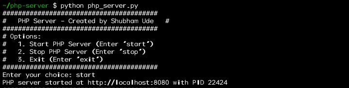

# PHP_Server-For_termux
# PHP Server Management Tool

This tool allows you to easily start and stop a PHP server on your Android device using Termux.
## Tool
  
## Instructions

### Install PHP and Python

1. Open Termux on your Android device.

2. Run the following commands to install PHP and Python:

   ```bash
   pkg install php
   pkg install python

## Execute the Tool

1. Download the tool script (php_server_tool.py) to your device.
  ```bash
   git clone https://github.com/Shubham-Ude/PHP_Server-For_termux.git
```
2. Open Termux and navigate to the directory where the script is located.
   ```bash
   cd PHP_Server-For_termux
   ```
3. Run the following command to execute the tool:

   ```bash
   python php_server_tool.py
4. Create and save your .php file in storage/download/server/php
5. You can use external editor like Code Editor 

## Tool Description

-The tool provides a simple user interface to start and stop a PHP server.

-PHP server files should be placed in the php folder within the server directory.

-The PID file for the PHP server is stored in the server directory.

## Notes

-This tool is created by Shubham Ude.

-Ensure you have the necessary permissions to access storage on your device.

-For any issues or suggestions, please email udes251@gmail.com

Happy coding!
